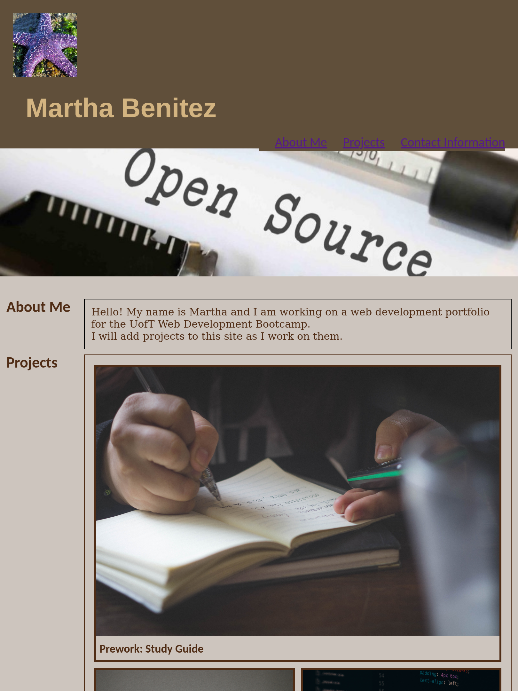

# Module 2: Advanced CSS - Professional Portfolio

## Description

This project is the foundation of a professional portfolio to showcase work developed during the UofT Web Development Bootcamp and, in the future, any other work highlighting my technical contributions to various open source projects.

## Installation

The project has already been deployed. Visit: [mbenitez1607's portfolio](https://mbenitez1607.github.io/module2-challenge/)

## Usage
 
When the portfolio (website) loads you are presented with the developer's name, an avatar, and links to sections "about me", "projects", and "contact me".

When clicking any of the links in the navigation menu at the top right, the UI scrolls to the corresponding section.

Clicking on the link to the "projects" section shows a section with titled images of the developer's applications. Clicking on the images of the applications takes you to that deployed application.

The site should be properly viewable on various screens and devices, adapting to your viewport.

## Credits

N/A

## License

 This work is licensed under a <a rel="license" href="http://creativecommons.org/licenses/by/4.0/">Creative Commons Attribution 4.0 International License</a>.
